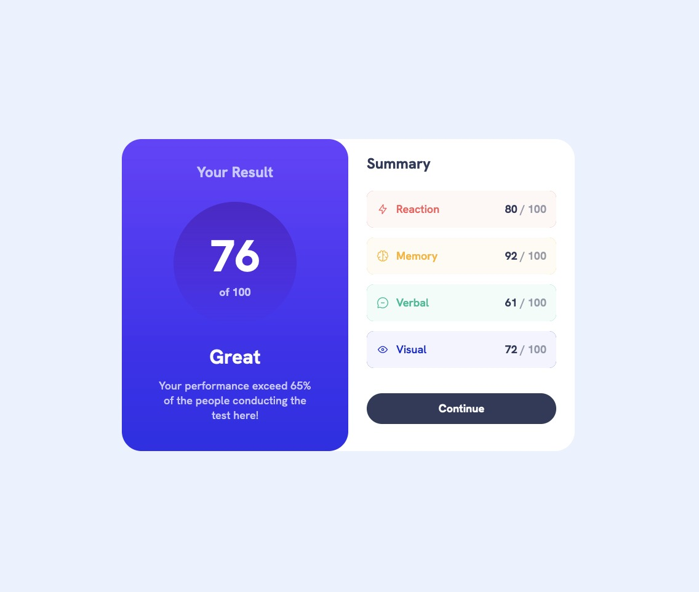
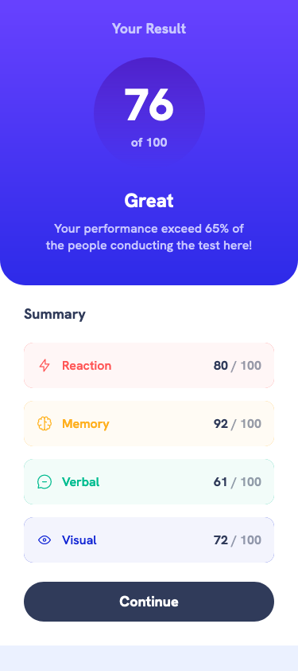
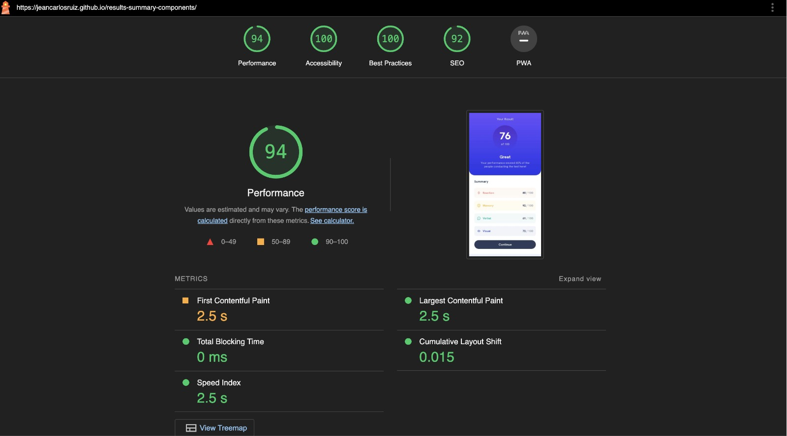

# Frontend Mentor - Results summary component solution

This is a solution to the [Results summary component challenge on Frontend Mentor](https://www.frontendmentor.io/challenges/results-summary-component-CE_K6s0maV). Frontend Mentor challenges help you improve your coding skills by building realistic projects.

## Table of contents

- [Overview](#overview)
  - [The challenge](#the-challenge)
  - [Screenshot](#screenshot)
  - [Links](#links)
- [My process](#my-process)
  - [Built with](#built-with)
  - [What I learned](#what-i-learned)
  - [Continued development](#continued-development)
- [Author](#author)
- [Acknowledgments](#acknowledgments)

**Note: Delete this note and update the table of contents based on what sections you keep.**

## Overview

### The challenge

Users should be able to:

- View the optimal layout for the interface depending on their device's screen size
- See hover and focus states for all interactive elements on the page

### Screenshot

,
,

### Links

- Solution URL: [Click to see the repository site](https://github.com/jeancarlosruiz/results-summary-components)
- Live Site URL: [Click to see the live site](https://jeancarlosruiz.github.io/results-summary-components/)

## My process

### Built with

- Semantic HTML5 markup
- CSS custom properties
- Flexbox
- CSS Grid
- Mobile-first workflow
- [React](https://reactjs.org/) - JS library
- CSS Modules

### What I learned

Practicing how to use React, and Css modules with small project.

### Continued development

Css modules and React are really powerfull tools Im deeply falling in love and confident with, I will making this kind of small project to keep practicing more.

## Author

- Website - [Jean Carlos Ruiz (Portfolio)](https://www.your-site.com) (Building website)
- Frontend Mentor - [@jeancarlosruiz](https://www.frontendmentor.io/profile/jeancarlosruiz)

## Acknowledgments

More than grateful to these amazing people who have been helping me throughout this process and building my template based on their references:

- [Josh W Comeau](https://www.joyofreact.com/)
- [Desarrollo Útil](https://www.youtube.com/@DesarrolloUtil)
